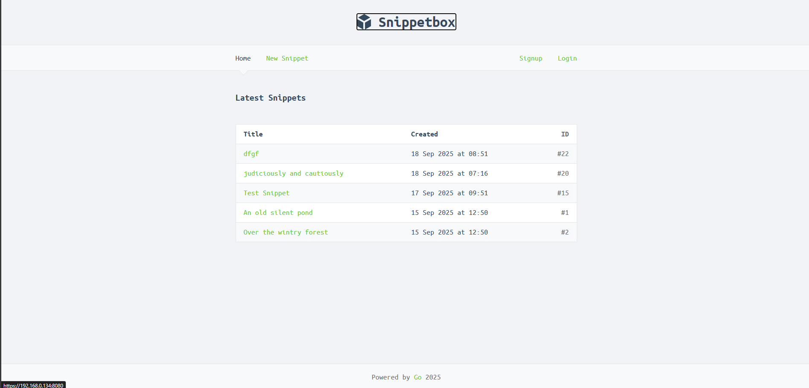

# snippetbox

SnippetBox is a web application developed in Go where people can login and create thier text snippets to share with their community.

the server features the GO standard liberary to implement the core functuanlities, mysql as database.

features:
- users can signup/login and logout
- user can create snippets
- sessions implemented for user context awareness
- security headers are pupulated to all requestes throught middleware
- json fomrated logging in place. 